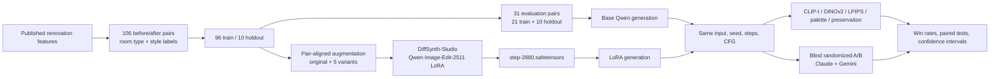
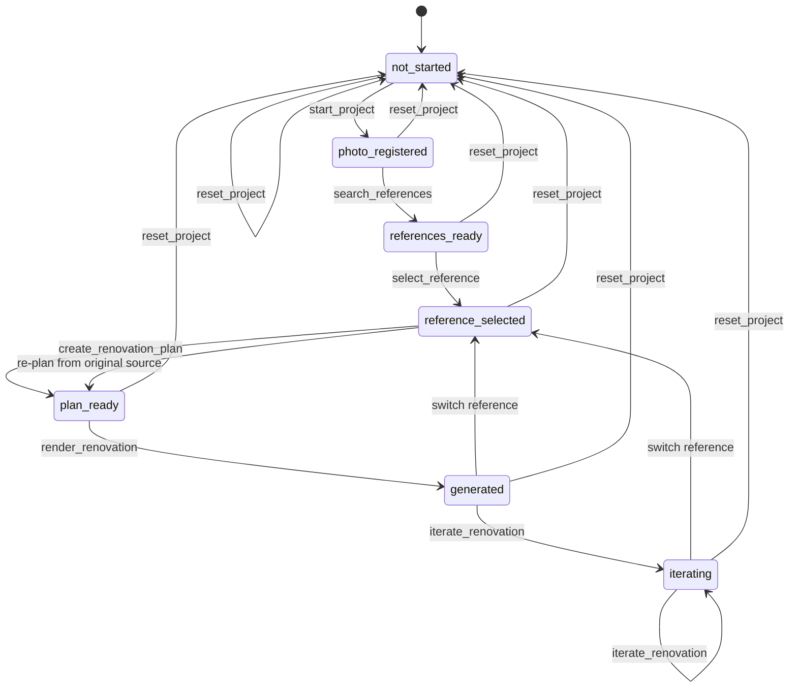
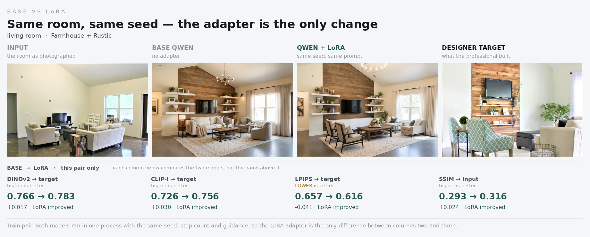

# Agentic Room Design Recommender

> **Retrieval-guided style discovery, structured multimodal planning, and controllable room-renovation generation with a domain-specialized Qwen-Image-Edit LoRA.**

[](https://github.com/aazamat7/agentic-room-design-recsys)
[](https://www.python.org/)
[](LICENSE)
[](https://cloud.google.com/)

## Overview

Most interior-design recommenders begin with historical purchases, saved boards, or explicit style profiles. Those signals are often unavailable for first-time users, especially for high-consideration purchases such as furniture and room renovation. This project addresses that **visual cold-start problem** directly.

Given a photo of an existing room, the system:

1. persists the source image and initializes a stateful renovation project;
2. retrieves visually relevant professional renovation references;
3. asks the user to select a preferred direction;
4. uses Gemini multimodal reasoning to convert the source room, selected reference, and conversational constraints into a structured design plan;
5. generates the initial renovation with **Qwen-Image-Edit-2511 + a room-renovation LoRA** through the same FastAPI endpoint used by the application;
6. optionally generates a Gemini image as an initial comparison; and
7. applies later user-requested edits to the latest accepted image.

The work combines two complementary artifacts:

- a **research pipeline** for dataset construction, LoRA training, base-versus-LoRA evaluation, statistical analysis, and reproducibility; and
- a **deployable agentic application** built with Google ADK, Gemini, Vertex AI Vector Search, GCS, a local Qwen-LoRA endpoint, and an optional Replicate iteration backend.

---

## Table of contents

- [Why this problem matters](#why-this-problem-matters)
- [Research questions](#research-questions)
- [Key contributions](#key-contributions)
- [System architecture](#system-architecture)
- [Agent workflow and state machine](#agent-workflow-and-state-machine)
- [Component design](#component-design)
- [Dataset](#dataset)
- [Training methodology](#training-methodology)
- [Evaluation methodology](#evaluation-methodology)
- [Results](#results)
- [What the results support](#what-the-results-support)
- [Repository structure](#repository-structure)
- [Quick start](#quick-start)
- [Configuration](#configuration)
- [Testing](#testing)
- [Limitations](#limitations)
- [Roadmap](#roadmap)
- [Data, licensing, and responsible use](#data-licensing-and-responsible-use)
- [References](#references)

---

## Why this problem matters

Room design is a difficult recommendation setting because:

- **preferences are visual and compositional** rather than reducible to product IDs;
- new users often have **no transaction or interaction history**;
- the source room imposes hard constraints on geometry, lighting, windows, doors, and perspective;
- users often know what they dislike but cannot name a formal design style;
- a good recommendation must be both **inspirational** and **physically plausible**; and
- generated images are useful only when the system can preserve the user's room and support iterative refinement.

The central product idea is to use professional room transformations as a retrieval and generation prior. Instead of asking a cold-start user to complete a long preference form, the system retrieves a small set of high-quality visual directions and lets the user choose.

### Strategic hypotheses

This project tests two broader ideas:

1. **Task specialization can compete with frontier generality.** A smaller open image editor, specialized with LoRA on a narrow renovation task, may offer better controllability, repeatability, versioning, and cost predictability than a closed general-purpose API.
2. **The durable advantage may be retrieval and data, not a proprietary foundation model.** A curated domain index and high-quality source-target pairs can remain valuable even as the underlying reasoning and generation models change.

The first hypothesis has preliminary empirical support in this repository. The second remains a product and retrieval hypothesis that requires dedicated retrieval ablations and user studies.

---

## Research questions

| ID | Research question | Evidence status |
|---|---|---|
| **RQ1** | Does a room-renovation LoRA improve Qwen-Image-Edit outputs relative to the untuned base model? | Evaluated on 31 base-versus-LoRA pairs with objective metrics and two blind judges. |
| **RQ2** | Can the deployed LoRA produce repeatable outputs for identical requests? | Evaluated through five repeated calls to the production HTTP endpoint with a fixed seed. |
| **RQ3** | How does the deployed LoRA compare with Gemini 3.1 Flash Image on stability and latency? | Evaluated on one source room with five calls per system. Quality win-rate rating is still pending. |
| **RQ4** | Does domain-specific multimodal retrieval improve preference discovery and final design acceptance? | Architecture implemented; formal retrieval ablation and user study are planned. |

---

## Key contributions

- **Curated paired renovation dataset:** 106 professional before/after room transformations with room type, style, evidence, and source metadata.
- **Pair-preserving augmentation:** five aligned variants per training pair, with geometric transforms shared across before/after images and realistic degradation applied only to the input side.
- **Domain-specialized image editor:** Qwen-Image-Edit-2511 fine-tuned with a LoRA adapter using DiffSynth-Studio.
- **Controlled evaluation:** base and LoRA outputs generated in one process with identical seeds and inference settings.
- **Multi-evidence judging:** target-reference metrics, blind LLM judges, confidence intervals, p-values, and explicit architecture-preservation caveats.
- **Retrieval-guided agent:** Gemini Embedding 2 + Vertex AI Vector Search retrieves top renovation references before generation.
- **Human-in-the-loop workflow:** the user selects one of the top references rather than allowing the agent to silently choose.
- **Structured multimodal planning:** Gemini converts the source, reference, user goal, and prior edits into a typed renovation plan.
- **Production LoRA serving:** the application calls a local FastAPI endpoint that owns the Qwen pipeline and LoRA on an A100 GPU.
- **Reproducibility benchmark:** identical LoRA endpoint calls were byte-for-byte stable under a fixed seed, while repeated Gemini calls varied.

---

## System architecture

### End-to-end application architecture

```mermaid
flowchart LR
    U[User conversation + room photo] --> A[Google ADK controller\nGemini 3.5 Flash]

    A --> T1[start_project]
    T1 --> GCS1[(GCS source image)]

    A --> T2[search_references]
    GCS1 --> EMB[Gemini Embedding 2\nmultimodal embedding]
    EMB --> VS[(Vertex AI Vector Search)]
    VS --> CAT[Metadata catalog / sidecar\nID -> image URI, style, caption]
    CAT --> TOP[Top 3 renovated references]
    TOP --> H{User selects\nreference 1, 2, or 3}

    H --> T3[create_renovation_plan]
    T3 --> REASON[Gemini 3.1 Pro Preview\nstructured multimodal reasoning]
    REASON --> PLAN[RenovationPlan\npreserve / change / palette / materials / negatives / Qwen prompt]

    PLAN --> GEN[render_renovation]
    GCS1 --> LORA[Qwen-Image-Edit-2511 + LoRA\nFastAPI /edit on A100]
    PLAN --> LORA
    LORA --> GCS2[(GCS LoRA output)]
    GCS2 --> ACTIVE[Active current image]

    PLAN -. optional initial comparison .-> GEMIMG[Gemini 3.1 Flash Image]
    GCS1 -.-> GEMIMG
    GEMIMG -.-> GCS3[(GCS comparison output)]

    ACTIVE --> ITER[iterate_renovation]
    ITER --> QWENITER[Qwen image-edit iteration backend\nReplicate in current deployment]
    QWENITER --> GCS4[(GCS updated image)]
    GCS4 --> ACTIVE
```



### Research and model-development architecture



### Deployment boundaries

The architecture intentionally separates concerns:

| Boundary | Responsibility |
|---|---|
| **ADK process** | Conversation, state transitions, tool invocation, error handling, and user presentation. |
| **Google Cloud services** | Gemini reasoning and image comparison, embeddings, Vector Search, GCS persistence, and signed previews. |
| **LoRA FastAPI process** | Loads the full Qwen pipeline and LoRA once, owns GPU memory, exposes `/health` and `/edit`. |
| **Iteration service** | Applies later delta edits to the latest generated image. |
| **Research pipeline** | Dataset preparation, model training, controlled inference, judging, and statistics. |

This avoids loading the 20B image model inside the conversational agent and prevents each ADK worker from owning another copy of the GPU pipeline.

---

## Agent workflow and state machine

The application is a **single stateful controller with deterministic tools**, rather than a collection of loosely coordinated sub-agents. The LLM interprets natural language, but every consequential external action is gated through a typed tool.



### Important workflow guarantees

- The agent never claims an image was registered, retrieved, selected, planned, or generated unless the corresponding tool returned `status="success"`.
- The user—not the agent—chooses the retrieved reference.
- The first renovation always starts from the **original source room**.
- Switching references after generation also restarts from the original source room.
- Later edit requests are deltas applied to the **latest generated image**.
- The LoRA output remains the active image even when Gemini produces an initial comparison.
- Gemini fallback is disabled during LoRA validation so endpoint failures cannot be silently hidden.

### Core project state

```text
project_id
stage
source_image_uri
source_preview_url
room_type
user_goal
reference_candidates
selected_reference
renovation_plan
initial_generation_prompt
current_image_uri
current_preview_url
generation_history
initial_comparison_outputs
```

---

## Component design

### 1. ADK conversational controller

**Model configured in the application package:** `gemini-3.5-flash`

Responsibilities:

- detect local, `gs://`, and HTTPS image paths;
- infer the shortest valid tool chain from a complex user turn;
- present exactly three retrieved references;
- interpret flexible selections such as `2`, `option 2`, or an exact reference ID;
- preserve current state across turns;
- distinguish reference switching from iterative editing;
- refresh signed preview URLs; and
- stop faithfully when a tool returns an error.

The controller does not perform shopping, Browserbase browsing, product retrieval, reranking, or bundle planning.

### 2. Image persistence

`GCSImageStore` stabilizes local or remote images into GCS and creates time-limited signed preview URLs. Stable GCS URIs are retained in state; signed URLs are refreshed when status is requested.

### 3. Multimodal retrieval

The retrieval layer:

1. loads the registered source room;
2. computes a Gemini Embedding 2 representation;
3. queries a deployed Vertex AI Vector Search index;
4. maps datapoint IDs through a metadata catalog; and
5. returns typed `ReferenceCandidate` objects containing rank, distance, image URI, style, room type, caption, and raw metadata.

The index is paired with a sidecar such as:

```json
{
  "id": "living_room_001",
  "image_uri": "gs://.../living_room_001.jpg",
  "style": "warm minimalist",
  "room_type": "living_room",
  "caption": "Warm oak, cream boucle, low visual clutter"
}
```

### 4. Structured renovation reasoning

`GeminiRenovationReasoner` receives:

- the original source room;
- the selected renovated reference;
- the user goal;
- current-turn notes;
- room type; and
- prior generation history.

It returns a validated `RenovationPlan`:

```python
class RenovationPlan(BaseModel):
    design_summary: str
    reference_style: str
    color_palette: list[str]
    materials: list[str]
    preserve: list[str]
    change: list[str]
    negative_constraints: list[str]
    qwen_prompt: str
```

This structured intermediate representation separates design reasoning from image generation and makes prompts inspectable, testable, and replaceable.

### 5. Initial Qwen + LoRA generation

The default production path is:

```text
Qwen-Image-Edit-2511 + step-2880 LoRA
        -> local FastAPI service
        -> POST /edit
        -> raw image/png
```

The endpoint contract is:

```text
multipart file: image
optional file: reference_image
form: prompt
form: seed
form: num_inference_steps
form: guidance_scale
form: extra_input_json
```

Current validated settings:

```text
seed                 fixed for reproducibility tests; -1 for random app generation
num_inference_steps  30
guidance_scale       4.0
zero_cond_t          true inside the DiffSynth server
reference image      not sent to LoRA in the validated app path
```

The selected reference is still used: Gemini reasoning translates its visual attributes into the detailed Qwen prompt.

### 6. Optional Gemini comparison

For the initial render only, the application can call `gemini-3.1-flash-image` with the same source and generated edit brief. The Gemini output is stored and displayed as a comparison, but it does not replace the active LoRA result.

### 7. Follow-up iteration

`iterate_renovation(...)` composes a delta-only prompt and applies the user edit to the current image. The current deployment uses a Qwen image-edit model through Replicate. This backend is independently swappable.

### 8. Backend abstraction

The application supports multiple initial-generation backends behind a shared interface:

- local HTTP LoRA service;
- custom Vertex AI endpoint;
- Replicate-hosted LoRA;
- Gemini Flash Image testing substitute; and
- optional Gemini fallback.

---

## Dataset

### Composition

The dataset contains **106 professional before/after room-renovation pairs**. Each record includes the original room, redesigned room, room type, split, primary/secondary style, a natural-language style description, label confidence, and source URL.

| Split | Independent room pairs | Augmentation | Purpose |
|---|---:|---:|---|
| Train | 96 | Original + 5 paired variants | LoRA training |
| Holdout | 10 | None | Generalization check |
| **Total** | **106** | — | — |

The 96 training pairs produce **576 effective training examples**, but only 96 independent training room identities.

### Room-type distribution

| Room type | Pairs |
|---|---:|
| Living room | 42 |
| Bedroom | 26 |
| Kitchen | 12 |
| Bathroom | 10 |
| Dining room | 9 |
| Entryway | 5 |
| Game room | 2 |

Living rooms and bedrooms account for 64.2% of the data. The most defensible task scope is therefore common living-room and bedroom renovation, not universal interior design.

### Primary-style distribution

| Primary style | Pairs |
|---|---:|
| Contemporary | 45 |
| Traditional | 41 |
| Farmhouse | 7 |
| Mid-Century Modern | 4 |
| Bohemian | 3 |
| Glam | 3 |
| Rustic | 2 |
| Scandinavian | 1 |

### Source concentration

The curated set is concentrated in professional editorial renovation content:

- HGTV: 85 pairs
- The Spruce: 19 pairs
- Apartment Therapy: 2 pairs

This provides high visual quality but creates domain, editorial, and licensing concentration. External-source evaluation is required before broad deployment claims.

### Data access

Images are hosted outside the repository to keep Git lightweight. Label manifests are versioned under `data/`.

- [Full dataset: 106 pairs](https://drive.google.com/drive/folders/1t1Oe6MwzNRrxxDAaYUJMOi3hS9tNn0ZQ)
- [Training set: 96 pairs with augmentation assets](https://drive.google.com/drive/folders/1BLyWKW4GkoX47oA9AP0MiZNEc9e9Lx8S)
- [Holdout set: 10 pairs](https://drive.google.com/drive/folders/1iL_flBHCpt-anCO0Grhpyi2b-HiSuo4E)

---

## Training methodology

### Pair-aligned augmentation

Each training pair is expanded into the original plus five variants.

**Geometric transforms** are sampled once per pair/variant and applied identically to source and target:

- crop/zoom;
- horizontal flip where appropriate; and
- small rotation.

This is essential. Applying different geometry to the before and after image would teach the model that renovation includes mirroring, reframing, or moving the camera.

**Photometric degradation** is applied only to the input side:

- color and exposure jitter;
- grain/noise; and
- JPEG recompression.

This approximates the production setting in which a user submits a noisy phone image but expects a polished result.

The holdout set is not augmented.

### LoRA training

- Base model: `Qwen/Qwen-Image-Edit-2511`
- Framework: DiffSynth-Studio
- LoRA target: Qwen DiT modules
- Precision: BF16
- Training hardware: one NVIDIA A100 80 GB
- Production checkpoint used by the endpoint: `step-2880.safetensors`
- Model-specific setting: `zero_cond_t`

The adapter is loaded by the FastAPI runtime using the same DiffSynth pipeline that was used for successful validation.

### Controlled base-versus-LoRA generation

Base and LoRA outputs are generated in one process:

1. load the base pipeline;
2. generate base outputs;
3. load the LoRA into the same pipeline; and
4. generate LoRA outputs with identical input, seed, dimensions, steps, and CFG.

This controls sampling noise so the difference within a pair is attributable to the adapter.

---

## Evaluation methodology

### Evaluation set

The base-versus-LoRA evaluation contains **31 pairs**:

- 21 sampled training-room pairs; and
- all 10 holdout pairs.

### Objective metrics

| Metric | Purpose | Direction |
|---|---|---|
| CLIP-I target similarity | Semantic/visual similarity to professional after-image | Higher is better |
| DINOv2 target similarity | Structural and visual representation similarity | Higher is better |
| LPIPS target distance | Perceptual distance to target | Lower is better |
| Palette similarity / Delta E | Color-palette alignment | Higher similarity / lower distance is better |
| Input SSIM and DINO | Preservation or transformation relative to source | Interpret as a trade-off, not pure quality |
| CLIP-T | Prompt alignment | Higher is better |
| Aesthetic / CLIP-IQA | Generic visual-quality signals | Higher is better, but not task-complete |

### Blind judges

Two multimodal judges compare randomized A/B outputs without seeing the model labels:

- **Judge A:** Claude
- **Judge B:** Gemini

The judges evaluate the renovation as a whole rather than only target-reference distance. Position randomization reduces left/right bias.

### Statistical reporting

The analysis reports:

- win rates;
- Wilson 95% confidence intervals;
- one-sided binomial tests against a 50% null;
- paired t-tests and Wilcoxon signed-rank tests for continuous metrics; and
- inter-judge agreement using raw agreement and Cohen's kappa.

### Production repeatability benchmark

A separate endpoint test uses the same HTTP path as the application:

- one room image (`room_check.png`);
- one fixed renovation prompt;
- five LoRA requests with seed 42;
- five Gemini requests using the app's current generation configuration;
- alternating call order;
- exact SHA-256 equality, SSIM, perceptual hash, latency, and failures.

This test measures **technical repeatability**, not broad quality or generalization.

---

## Results



A single training pair, shown before the aggregate numbers. Both outputs were generated in one run with the same seed, step count and guidance, so the LoRA adapter is the only difference between the second and third columns. This pair is one of the strongest in the evaluation set — across all 31 pairs the metrics move against the LoRA on roughly a third of them.

## 1. Base Qwen versus LoRA: blind judge results

| Split | Judge | LoRA wins | Win rate | Wilson 95% CI | One-sided p-value |
|---|---|---:|---:|---:|---:|
| Train | Claude | 11 / 21 | 52.4% | 32.4%–71.7% | 0.5000 |
| Train | Gemini | 17 / 21 | 81.0% | 60.0%–92.3% | 0.0036 |
| Holdout | Claude | 9 / 10 | 90.0% | 59.6%–98.2% | 0.0107 |
| Holdout | Gemini | 8 / 10 | 80.0% | 49.0%–94.3% | 0.0547 |
| **Overall** | **Claude** | **20 / 31** | **64.5%** | **46.9%–78.9%** | **0.0748** |
| **Overall** | **Gemini** | **25 / 31** | **80.6%** | **63.7%–90.8%** | **0.0004** |

The overall direction is favorable to the LoRA. Gemini provides strong evidence against the 50% null; Claude's pooled result is positive but does not cross the conventional 5% threshold. The holdout result is encouraging but based on only ten rooms.

The two judges produced:

- raw agreement: **71.0%**;
- Cohen's kappa: **0.294** overall;
- holdout kappa: **0.615**; and
- train kappa: **0.215**.

The 62 judge votes are not 62 independent room observations because both judges scored the same 31 pairs.

## 2. Target-reference metric win rates

A metric win means the LoRA output is closer to the professional after-image than the base output.

| Metric | LoRA wins | Win rate | One-sided p-value |
|---|---:|---:|---:|
| CLIP-I target similarity | 22 / 31 | 71.0% | 0.0147 |
| DINOv2 target similarity | 21 / 31 | 67.7% | 0.0354 |
| LPIPS target distance | 22 / 31 | 71.0% | 0.0147 |
| Palette similarity | 16 / 31 | 51.6% | 0.5000 |

### Paired mean changes

| Metric | Base mean | LoRA mean | LoRA change | Interpretation |
|---|---:|---:|---:|---|
| CLIP-I to target | 0.7323 | 0.7590 | +0.0267 | Statistically favorable in pooled paired tests |
| DINOv2 to target | — | — | +0.0400 | Positive; test significance differs by test choice |
| LPIPS to target | — | — | −0.0090 distance | Small perceptual improvement |
| Palette score | — | — | +0.0076 | No meaningful pooled evidence |
| SSIM to input | 0.3393 | 0.3008 | −0.0385 | Stronger transformation, but greater preservation risk |

No single reference metric tells the full story. A model can move closer to a generic professional target while changing the room type or architecture incorrectly.

## 3. Deployed LoRA endpoint versus Gemini: repeatability and latency

**Scope:** one input room, one prompt, five calls per system. This is an engineering smoke test, not a final model-quality benchmark.

| System | Successful calls | Failure rate | Mean latency | Latency SD | Exact pair-match rate | Mean pairwise SSIM | Mean pHash similarity |
|---|---:|---:|---:|---:|---:|---:|---:|
| Gemini 3.1 Flash Image | 5 / 5 | 0% | 13.04 s | 1.89 s | 0% | 0.5335 | 0.8219 |
| Qwen-Image-Edit-2511 + LoRA endpoint | 5 / 5 | 0% | 65.44 s | 0.17 s | 100% | 1.0000 | 1.0000 |

Observed outputs:

- all five LoRA calls returned the same SHA-256 hash, dimensions, and pixels under seed 42;
- all five Gemini outputs had different hashes;
- the LoRA was approximately **5.0× slower** in this unoptimized single-request deployment; and
- both systems completed every request successfully.

### What is not yet measured

The notebook generated blinded LoRA-versus-Gemini A/B sheets, but the rating file had not yet been completed. Therefore:

- no LoRA-versus-Gemini **quality win rate** is reported;
- reproducibility must not be presented as proof of superior aesthetic quality; and
- the latency result should not be generalized beyond this instance, model version, image size, and serving implementation.

---

## What the results support

### Supported claims

- The LoRA is directionally preferred to the base Qwen model in the existing 31-pair evaluation.
- The LoRA usually moves outputs closer to the professional target on CLIP-I, DINOv2, and LPIPS.
- The deployed self-hosted endpoint can be exactly repeatable under a fixed seed and frozen environment.
- The managed Gemini image path is substantially faster in the current single-request test.
- Self-hosting gives direct control over checkpoint, LoRA weights, seed, inference steps, CFG, preprocessing, software environment, and endpoint version.

### Claims not supported yet

- The LoRA is universally better for every room type, style, or judge.
- The LoRA is better than Gemini in aesthetic quality.
- Retrieval has been proven to increase acceptance or conversion.
- The ten-room holdout establishes production-level generalization.
- Reference-similarity metrics alone establish architectural correctness.
- A single input repeatability test establishes performance over the full user distribution.

### Practical interpretation

The evidence supports a nuanced conclusion:

> A narrow, self-hosted LoRA can provide strong task specialization, controllability, versioning, and deterministic regression testing. Gemini remains a faster and highly capable general-purpose baseline. The strongest production system can combine domain retrieval and reasoning with a specialized generator, while evaluating quality, preservation, latency, and cost separately.

---

## Repository structure

### Public research repository

```text
data/
  pairs_with_style.csv                 full labels and source metadata
  train_manifest.csv                   96-pair training split
  holdout_manifest.csv                 10-pair holdout split
  dataset_augmentation.ipynb           pair-aligned augmentation
  gallery.html                         visual sample gallery

eval/
  evaluate_comparisons.py              blind Claude + Gemini judging
  build_tables.py                      win rates and statistical tables
  make_report.py                       side-by-side figures and report
  eval_analysis.py                     standalone result analysis

results/
  per_pair_full.csv                    all objective metrics for 31 pairs
  metrics_train.csv                    train-slice metrics
  metrics_holdout.csv                  holdout-slice metrics
  judges_v2_21.csv                     train judge verdicts
  judges_v2_10.csv                     holdout judge verdicts
  winrate_train.csv                    room-type train win rates
  winrate_holdout.csv                  room-type holdout win rates

src/
  generate_base_and_lora_diffsynth.py  controlled base + LoRA inference
  furnish_prompt.py                    generation prompt construction
  compare_variants.py                  prompt-variant comparison

README.md
LICENSE
```

### Deployable ADK runtime

The application runtime is maintained as a separate `shopping_agent_v2` package and can be incorporated into this repository under an `app/` or `runtime/` directory.

```text
renovation_adk_harness_streamlined/
  renovation_agent/
    agent.py                           ADK conversational controller
    bootstrap.py                       Vertex/ADC environment bootstrapping
    config.py                          Pydantic environment settings
    schemas.py                         typed state and output schemas
    tools.py                           state transitions and tool chain
    services/
      gemini_reasoner.py               structured multimodal planning
      vector_search.py                 Embedding 2 + Vector Search
      metadata_catalog.py              datapoint-to-image mapping
      gcs_store.py                     durable images and signed URLs
      image_io.py                      local / GCS / HTTPS loading
      qwen_backends.py                 LoRA, Gemini, Vertex, Replicate backends
  scripts/
    check_lora_api.py                  production endpoint smoke test
    search_reference_smoke_test.py     real retrieval test
    inspect_vector_index.py            resource discovery diagnostics
    mock_qwen_lora_server.py           contract-only testing
  tests/
    test_lora_http_backend.py
    test_metadata_catalog.py
    test_prompts.py
    test_qwen_output.py
  .env.example
  INSTALL_AND_RUN.md
  pyproject.toml
  requirements.txt
  Dockerfile
```

---

## Quick start

## A. Research repository

```bash
git clone https://github.com/aazamat7/agentic-room-design-recsys.git
cd agentic-room-design-recsys
```

Install the dependencies required by the notebooks and evaluation scripts in your environment, then download the image assets from the Drive links above.

### Generate controlled base and LoRA outputs

Run from the DiffSynth-Studio directory so local model files are resolved from `./models`:

```bash
cd ~/DiffSynth-Studio
python /path/to/agentic-room-design-recsys/src/generate_base_and_lora_diffsynth.py --n 21
```

The script performs base and LoRA passes in one process with identical inference settings.

### Run evaluation

```bash
python eval/evaluate_comparisons.py
python eval/build_tables.py
python eval/eval_analysis.py
python eval/make_report.py
```

Review each script's arguments and environment variables before running paid model judges.

## B. Start the production LoRA endpoint

Run this in the Python environment that already contains the working DiffSynth installation:

```bash
cd /home/jupyter/DiffSynth-Studio

LORA_PATH=/home/jupyter/recovered/qwen2511_lora_output/step-2880.safetensors \
python -m uvicorn lora_fastapi_server:app \
  --host 127.0.0.1 \
  --port 8001 \
  --workers 1
```

Do not use `--reload` or more than one worker. Every worker would load another full Qwen pipeline into GPU memory.

Check readiness from a second terminal:

```bash
curl -fsS http://127.0.0.1:8001/health | python -m json.tool
```

Expected status:

```json
{
  "status": "ready",
  "model_id": "Qwen/Qwen-Image-Edit-2511",
  "cuda_available": true
}
```

Direct endpoint smoke test:

```bash
curl -sS \
  -F "image=@/path/to/room.png" \
  -F "prompt=Create a photorealistic furnished renovation while preserving the exact architecture." \
  -F "seed=42" \
  -F "num_inference_steps=30" \
  -F "guidance_scale=4.0" \
  http://127.0.0.1:8001/edit \
  -o /tmp/lora_api_test.png
```

## C. Start the ADK application

```bash
cd /path/to/renovation_adk_harness_streamlined
python -m pip install -e .
cp .env.example .env
```

Authenticate with Google Cloud ADC:

```bash
gcloud auth application-default login
gcloud auth application-default set-quota-project adsp-s26-reccys
gcloud config set project adsp-s26-reccys
```

Validate the exact HTTP client:

```bash
python scripts/check_lora_api.py \
  --image images/room_check.png \
  --output images/generated/lora_api_test.png
```

Run the web interface:

```bash
adk web .
```

Alternative modes:

```bash
adk run renovation_agent
adk api_server --host 0.0.0.0 --port 8000 .
```

---

## Configuration

### Google Cloud and Gemini

```dotenv
GOOGLE_CLOUD_PROJECT=adsp-s26-reccys
GOOGLE_GENAI_USE_VERTEXAI=TRUE
GOOGLE_CLOUD_LOCATION=global
GEMINI_LOCATION=global
ORCHESTRATION_MODEL=gemini-3.5-flash
GEMINI_REASONING_MODEL=gemini-3.1-pro-preview
GEMINI_EMBEDDING_MODEL=gemini-embedding-2
EMBEDDING_LOCATION=us
```

### Vector Search

```dotenv
VECTOR_LOCATION=us-central1
VECTOR_DATA_PREFIX=gs://adsp-s26-reccys-bucket/living-room-renovation-index
VECTOR_INDEX_DISPLAY_NAME=living-room-renovation-index
VECTOR_METADATA_URI=gs://adsp-s26-reccys-bucket/living-room-renovation-index/catalog.json
DEFAULT_NUM_NEIGHBORS=3
```

Optional explicit resource overrides:

```dotenv
VECTOR_INDEX_NAME=projects/.../locations/us-central1/indexes/INDEX_ID
VECTOR_INDEX_ENDPOINT_NAME=projects/.../locations/us-central1/indexEndpoints/ENDPOINT_ID
DEPLOYED_INDEX_ID=DEPLOYED_ID
EMBEDDING_DIMENSION=3072
```

### Image persistence

```dotenv
OUTPUT_BUCKET=adsp-s26-reccys-bucket
OUTPUT_PREFIX=renovation-agent-outputs
SIGNED_URL_TTL_MINUTES=120
MAX_IMAGE_BYTES=25000000
```

### Initial LoRA generation

```dotenv
QWEN_LORA_BACKEND=http
QWEN_LORA_API_URL=http://127.0.0.1:8001/edit
QWEN_LORA_HEALTH_URL=http://127.0.0.1:8001/health
QWEN_LORA_HEALTHCHECK_BEFORE_GENERATION=true
QWEN_LORA_SEND_REFERENCE_IMAGE=false
NUM_INFERENCE_STEPS=30
GUIDANCE_SCALE=4.0
GENERATION_TIMEOUT_SECONDS=1200
```

### Gemini comparison and fallback

```dotenv
GENERATE_INITIAL_GEMINI_COMPARISON=true
INITIAL_GEMINI_IMAGE_MODEL=gemini-3.1-flash-image

# Keep false while validating the LoRA path.
ENABLE_INITIAL_GEMINI_FALLBACK=false
GEMINI_IMAGE_FALLBACK_MODEL=gemini-3.1-flash-image
```

### Follow-up iterations

```dotenv
REPLICATE_API_TOKEN=
REPLICATE_ITERATION_MODEL=qwen/qwen-image-edit
REPLICATE_ITERATION_IMAGE_FIELD=image
REPLICATE_ITERATION_PROMPT_FIELD=prompt
REPLICATE_ITERATION_REFERENCE_FIELD=
REPLICATE_ITERATION_EXTRA_INPUT_JSON={}
```

Never commit `.env`, API keys, access tokens, signed URLs, or private endpoint credentials.

---

## Example conversation

### 1. Register a room and retrieve references

```text
image_path="/absolute/path/to/room.jpg"
Make it warm, modern, uncluttered, and slightly Japandi.
```

The agent registers the image, retrieves the top three references, displays them, and waits.

### 2. Select and generate

```text
Use option 2, but keep the room bright and avoid dark wood.
```

The agent selects the reference, builds a structured plan, generates the LoRA result, and optionally shows the Gemini comparison.

### 3. Iterate

```text
Make the sofa lighter beige, remove the side-table accessories, and keep everything else unchanged.
```

The agent applies the edit to the active LoRA image through the iteration backend.

### 4. Switch the reference

```text
Use reference 1 instead, but retain the brighter palette.
```

The system re-plans and regenerates from the original source room rather than editing the previous result.

---

## Testing

### Application tests

```bash
pytest -q
```

The current tests cover:

- exact HTTP multipart contract;
- health-check behavior;
- omission of the reference image in the validated LoRA path;
- prompt preservation and delta-only iteration prompts;
- metadata-catalog mapping; and
- output normalization.

### Retrieval smoke test

```bash
python scripts/inspect_vector_index.py
python scripts/search_reference_smoke_test.py /absolute/path/to/room.jpg --top-k 3
```

### Production endpoint smoke test

```bash
python scripts/check_lora_api.py \
  --image images/room_check.png \
  --output images/generated/lora_api_test.png
```

### Reproducibility test

Run the endpoint-versus-Gemini benchmark notebook and retain:

- request manifest;
- exact hashes;
- pairwise stability metrics;
- latency summary;
- contact sheets;
- blind A/B key; and
- completed rating sheet.

A serious release test should use multiple unseen rooms and multiple prompts, not only `room_check.png`.

---

## Limitations

1. **Small independent dataset.** Augmentation creates 576 training examples but does not create new room identities.
2. **Tiny holdout.** Ten rooms are insufficient for high-confidence claims across room types and styles.
3. **Class imbalance.** Living rooms, bedrooms, Contemporary, and Traditional styles dominate.
4. **Source concentration.** Most examples come from one editorial ecosystem.
5. **Architecture drift.** The LoRA sometimes makes stronger changes than desired; lower source SSIM is both a sign of transformation and a preservation risk.
6. **Room-type leakage.** Furniture-enumerating prompts can pull bathrooms or dining rooms toward a living-room template.
7. **Reference metrics are incomplete.** Closeness to a professional after-image can reward replacing the room rather than preserving it.
8. **Judge disagreement.** Claude and Gemini weight completeness, plausibility, and layout differently.
9. **Endpoint benchmark scope.** The reported LoRA-versus-Gemini repeatability result uses one room and one prompt.
10. **No completed Gemini quality win rate.** Blind comparison sheets exist, but ratings are not complete.
11. **Managed-model drift.** Gemini aliases, safety behavior, and backend implementation can change over time.
12. **Self-hosted latency.** The local LoRA endpoint is slower than Gemini in the current single-request implementation and has not been optimized with batching, compilation, quantization, or concurrency.
13. **Cold-start preference ambiguity.** A visually similar retrieved room may not represent the user's functional needs, budget, culture, or accessibility requirements.
14. **Retrieval value is not yet causal evidence.** The vector layer is operational, but no randomized user study has established uplift in acceptance or satisfaction.
15. **Rights and privacy.** Editorial images and user-uploaded home photos require careful licensing, access control, retention, and deletion policies.

---- 


## Data, licensing, and responsible use

The MIT license applies to repository code unless stated otherwise. It does **not** automatically grant rights to third-party photographs, publisher content, model weights, or hosted APIs.

Before redistributing or using the image dataset commercially:

- verify the license and terms for each source image;
- retain source URLs and attribution metadata;
- avoid treating public accessibility as redistribution permission;
- remove images when rights cannot be established;
- document synthetic, generated, and human-edited records separately; and
- avoid training on private user rooms without informed consent.

For user-uploaded room photos:

- minimize retention;
- use private GCS objects;
- issue short-lived signed URLs;
- avoid logging raw images or secret-bearing URLs;
- support deletion of source and generated assets; and
- disclose that generated designs are conceptual, not architectural or safety advice.

---

## References

### Project and model resources

- [Project repository](https://github.com/aazamat7/agentic-room-design-recsys)
- [Qwen-Image-Edit-2511 model card](https://huggingface.co/Qwen/Qwen-Image-Edit-2511)
- [Qwen-Image repository](https://github.com/QwenLM/Qwen-Image)
- [DiffSynth-Studio](https://github.com/modelscope/DiffSynth-Studio)
- [Google Agent Development Kit](https://google.github.io/adk-docs/)
- [Gemini image generation documentation](https://ai.google.dev/gemini-api/docs/image-generation)
- [Vertex AI Vector Search](https://cloud.google.com/vertex-ai/docs/vector-search/overview)

### Related research directions

- conversational recommender systems;
- multimodal cold-start preference modeling;
- visual compatibility and interior-design recommendation;
- domain-specific multimodal embeddings;
- controllable image editing and preference-based evaluation.

---

## Citation

A formal publication citation is not yet available. For coursework or demonstrations, cite the repository:

```bibtex
@misc{agentic_room_design_recsys_2026,
  title        = {Agentic Room Design Recommender},
  year         = {2026},
  howpublished = {GitHub repository},
  url          = {https://github.com/aazamat7/agentic-room-design-recsys}
}
```

---

## License

Code in this repository is released under the [MIT License](LICENSE). Third-party data, model weights, and hosted services retain their original terms.
