# Room redesign dataset — before / after with style labels

10 of 106 labelled pairs. Holdout pairs are marked in orange.
Every *after* image is the professionally staged HGTV redesign of that same room — the target the model is measured against.

Full labels, style evidence and source URLs: [`pairs_with_style.csv`](pairs_with_style.csv) · 5 train · 5 holdout

---

### 1. Living Room &nbsp;

| BEFORE | AFTER (HGTV target) |
|:---:|:---:|
| 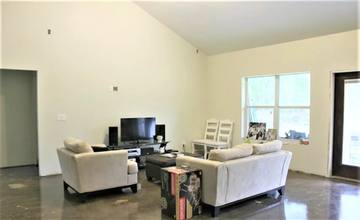 | 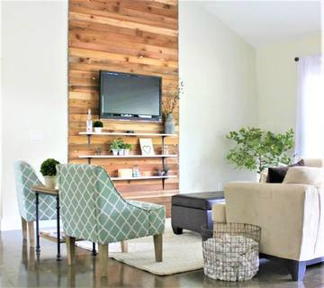 |

**Farmhouse** + Rustic

Cream walls with wood plank accent, floating white shelves, polished concrete flooring, bright natural light, rustic modern

---

### 2. Living Room &nbsp;

| BEFORE | AFTER (HGTV target) |
|:---:|:---:|
| 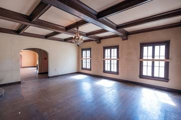 | 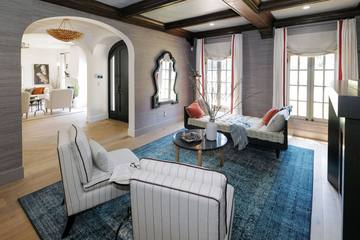 |

**Traditional** + Contemporary

Gray grasscloth walls, dark wood coffered ceiling, light oak flooring, blue patterned rug, recessed lighting, transitional

---

### 3. Living Room &nbsp;

| BEFORE | AFTER (HGTV target) |
|:---:|:---:|
| 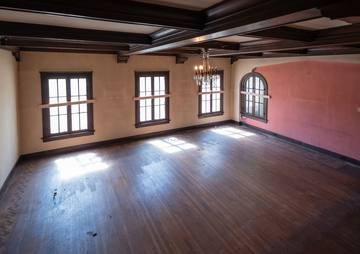 | 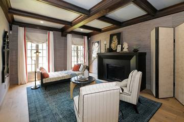 |

**Traditional** + Contemporary

grey grasscloth walls, black fireplace mantel, light oak flooring with blue rug, brass floor lamp, sophisticated transitional

---

### 4. Bedroom &nbsp;

| BEFORE | AFTER (HGTV target) |
|:---:|:---:|
| 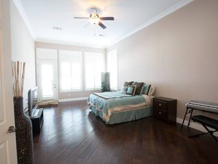 | 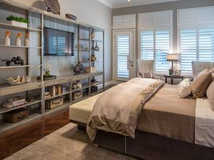 |

**Traditional** + Contemporary

warm gray walls, weathered metal open shelving, dark wood flooring, warm table lamp lighting, transitional

---

### 5. Kitchen &nbsp;

| BEFORE | AFTER (HGTV target) |
|:---:|:---:|
| 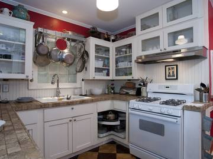 | 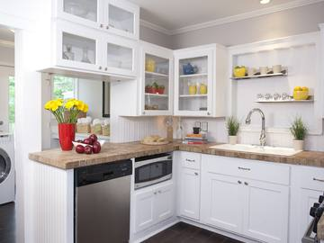 |

**Farmhouse** + Traditional

light gray walls, white beadboard, white glass-front shaker cabinetry, dark wood flooring, recessed lighting, modern cottage

---

### 6. Bathroom &nbsp;

| BEFORE | AFTER (HGTV target) |
|:---:|:---:|
| 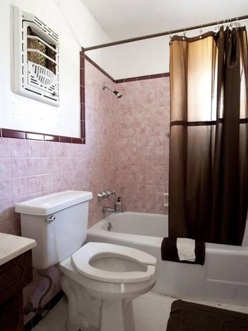 | 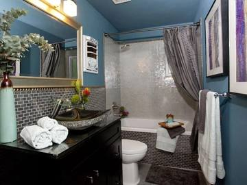 |

**Contemporary** + Modern

teal walls, iridescent mosaic tiling, dark espresso vanity, gray tile flooring, warm vanity lighting, contemporary eclectic

---

### 7. Dining Room &nbsp;

| BEFORE | AFTER (HGTV target) |
|:---:|:---:|
| 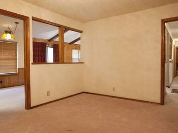 | 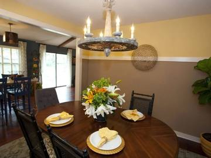 |

**Traditional** + Rustic

Two-tone mustard and brown walls with white trim, dark hardwood flooring, rustic wagon-wheel candle chandelier, warm traditional

---

### 8. Entryway &nbsp;

| BEFORE | AFTER (HGTV target) |
|:---:|:---:|
| 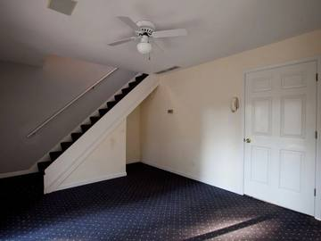 | 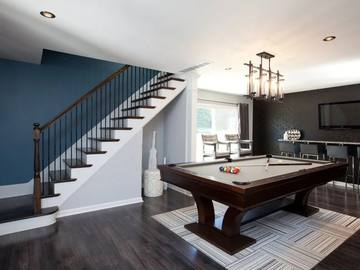 |

**Contemporary** + Traditional

deep blue and charcoal walls, dark wood flooring, industrial glass cylinder chandelier, contemporary game room

---

### 9. Bedroom &nbsp;

| BEFORE | AFTER (HGTV target) |
|:---:|:---:|
| 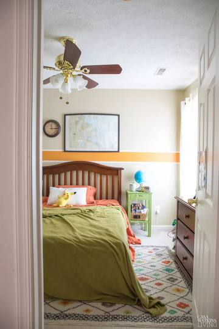 | 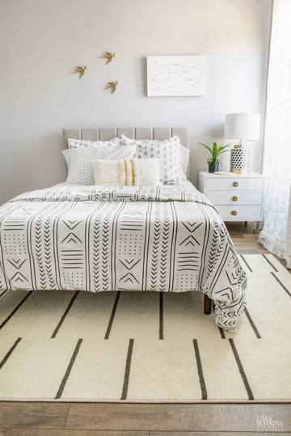 |

**Contemporary** + Bohemian

pale gray walls, white nightstand, wood flooring with striped cream rug, patterned ceramic table lamp, modern bohemian

---

### 10. Kitchen &nbsp;

| BEFORE | AFTER (HGTV target) |
|:---:|:---:|
| 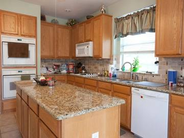 | 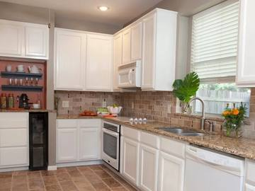 |

**Traditional** + Rustic

taupe walls with terracotta accent, white raised-panel cabinetry, granite countertops, brown tile flooring, recessed lighting, transitional

---

Images are reproduced at reduced resolution to illustrate the dataset used in this academic project. All rights remain with the original publishers.
